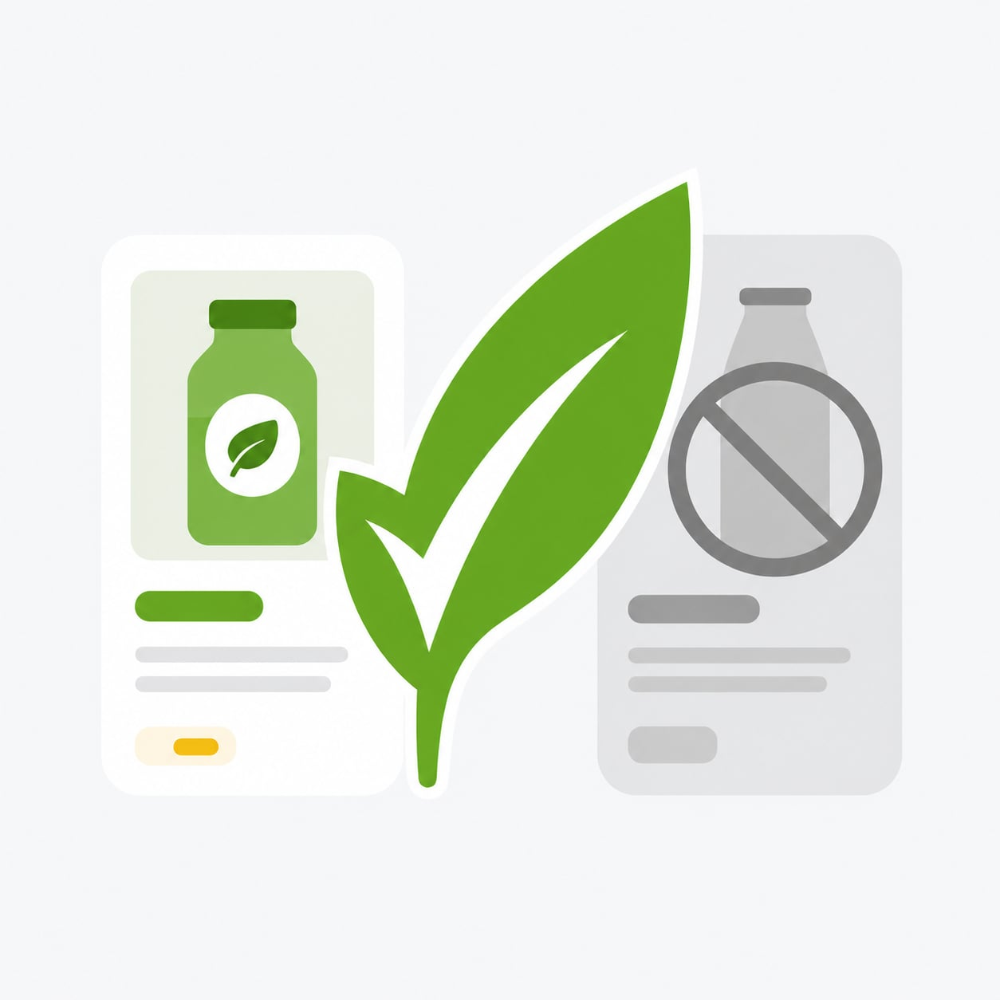

# Ocado Vegan Filter

Ocado Vegan Filter is a userscript that improves Ocado's incomplete vegan filtering on product grids, search results, category pages, and promotion pages.

Install it from Greasy Fork:

https://greasyfork.org/en/scripts/576838-ocado-vegan-filter

## What It Does

Ocado already has a vegan icon and filter, but some vegan products are missing from that metadata or do not show the vegan icon in product grids.

This script adds a client-side correction layer. It embeds over 19,000 vegan product IDs from an offline Ocado catalogue audit, including over 14,000 products beyond the officially tagged vegan set seen in the audit.

Products identified as vegan keep Ocado's normal styling and yellow `Add` button.

Known non-vegan products and products without enough evidence for a safe classification are visually muted:

- The product image is faded and desaturated.
- Promotional red text is muted.
- The `Add` button is restyled to look more like Ocado's grey out-of-stock controls.
- The button label shows `Not vegan` for an affirmative non-vegan classification or `Unknown vegan` when the evidence is inconclusive, and changes to `Add anyway` on hover.

The filter is cosmetic only. Product links still work, and the real Ocado `Add` button remains clickable.

## Screenshots

<p>
  
  
</p>

## How Products Are Treated As Vegan

The script treats a product as vegan when any of these are true:

- Ocado officially tags it as vegan.
- The product name contains the standalone word `vegan`.
- Ocado product page text explicitly says it is vegan, including manufacturer text, dietary information, or product features.
- Embedded catalogue data supports a conservative vegan-by-ingredients classification.

Live or embedded official Ocado vegan metadata is authoritative and takes precedence over the script's embedded non-vegan evidence.

`Not vegan` means that the offline audit found affirmative non-vegan evidence. `Unknown vegan` means that the stored evidence is insufficient to establish either vegan or non-vegan status safely.

## Data And Privacy

The userscript is self-contained while shopping. It does not fetch Ocado product detail pages in the background, and it does not call third-party services.

The large local SQLite database and raw scrape streams are intentionally not tracked in this repository.

## Repository Contents

### Userscript

- `ocado-vegan-filter.user.js` - the complete distributable userscript published on Greasy Fork.
- [Firefox performance and code audit](docs/code-audit-2026-09-04.md) - measured improvements, fixes, and reproducible browser benchmarks.

### Classification And Database Tooling

- `tools/build_ocado_database.py` - historical JSONL importer and shared parsing/schema helpers. Its CLI deletes and rebuilds the output database; it is not a normal setup or refresh command.
- `tools/sync_ocado_database.py` - imports and synchronises scraped Ocado product data into SQLite.
- `tools/classify_ocado_vegan.py` - classifies products as `vegan`, `nonvegan`, or `unknown` from stored database data.
- `tools/benchmark_ocado_vegan.py` - runs the fixed, read-only classifier safety benchmark.
- `tools/update_userscript_allowlists.py` - previews and regenerates the embedded sets from canonical SQLite classifications while preserving retained ID order.
- `docs/working-guide.md` - environment setup, code map, safe inspection, and troubleshooting for maintainers.
- `docs/vegan-classifier-design.md` - notes describing the intended offline vegan-classification workflow.
- `docs/monthly-maintenance.md` - the monthly scrape, classification, validation, and userscript update runbook.
- `docs/model-benchmark-2026-08-21.md` - evidence supporting the current Luna/high classifier default.
- `docs/firemonkey-installation.md` - installs and verifies the tagged release in local FireMonkey for pre-publication testing.

### Scraping Tooling

- `tools/scan_ocado_vegan_according_to_manufacturer.py` - finds products whose page text explicitly says they are vegan.
- `tools/scan_ocado_vegan_according_to_manufacturer_sitemap.py` - sitemap-based support for the manufacturer-text scan.
- `tools/scan_ocado_vegan_according_to_ingredients.py` - legacy JSONL tooling retained for raw scrape archaeology; monthly maintenance uses the DB-first sync instead.

### Retained Audit Outputs

These files are small enough to keep in Git and document the public outputs of the audit:

- `audit/benchmarks/*.json` - dated monthly classifier regression results created by the maintenance runbook.
- `audit/monthly/*.md` - retained scrape, classification, validation, and userscript-update summaries.
- `audit/manufacturer/ocado_vegan_according_to_manufacturer_urls.txt` - manufacturer-text vegan URL list.
- `audit/manufacturer/ocado_vegan_according_to_manufacturer_new_urls.txt` - follow-up manufacturer-text vegan URL list.
- `audit/manufacturer/ocado_vegan_according_to_manufacturer_audit.csv` - structured audit rows for the manufacturer-text list.
- `audit/manufacturer/ocado_vegan_according_to_manufacturer_audit.json` - JSON form of the manufacturer-text audit.
- `audit/manufacturer/ocado_vegan_according_to_manufacturer_meta.json` - metadata for the manufacturer-text scan.
- `audit/manufacturer/ocado_vegan_according_to_manufacturer_cover_letter.txt` - customer-services cover note for reporting catalogue issues.
- `audit/ingredients/ocado_vegan_according_to_ingredients_meta.json` - metadata for the ingredients-based scan.

### Images

- `assets/images/logo.jpg` - full-resolution logo used on the Greasy Fork page.
- `assets/images/screenshot.jpg` - full-resolution product-grid screenshot used on the Greasy Fork page.

### Tests

- `tests/test_ocado_vegan_filter.py` - userscript source and browser-fixture smoke tests.
- `tests/test_classify_ocado_vegan.py` - vegan classifier tests.
- `tests/test_build_ocado_database.py` - database schema/build tests.
- `tests/test_sync_ocado_database.py` - database synchronisation tests.
- `tests/test_benchmark_ocado_vegan.py` - frozen classifier benchmark fixture and runner tests.
- `tests/test_update_userscript_allowlists.py` - export safety gates and minimal-diff regeneration tests.
- `tests/test_ocado_vegan_according_to_ingredients.py` - ingredients-scan helper tests.

### Project Metadata

- `README.md` - this file.
- `LICENSE` - the Unlicense text.
- `AGENTS.md` - repository-specific automation instructions.
- `.gitignore` - excludes local databases, raw scrape streams, virtual environments, and caches.
- `.flake8` - Python lint configuration.
- `.github/workflows/release.yml` - publishes userscript assets to GitHub Releases when a release tag is pushed.
- `.github/workflows/test.yml` - runs the Python suite and Firefox fixtures for main, pull requests, and the release workflow.

### Intentionally Not Tracked

- `ocado_products.sqlite` and SQLite backups - local source-of-truth database files.
- `*.jsonl` scrape streams - large raw/pre-check scrape outputs.
- `.venv/` and `__pycache__/` - local development environment and Python cache files.

## Development

The distributable userscript source is:

```text
ocado-vegan-filter.user.js
```

Read [AGENTS.md](AGENTS.md) and [the working guide](docs/working-guide.md) before maintenance. Use a virtual environment for the development dependencies:

```sh
python3 -m venv .venv
source .venv/bin/activate
python3 -m pip install -r requirements-dev.txt
```

Reuse the existing `.venv` when available. With it active, useful checks are:

```sh
node --check ocado-vegan-filter.user.js
python3 -m unittest discover -s tests
OCADO_LIVE_TESTS=1 python3 -m unittest discover -s tests -p test_ocado_vegan_filter.py
```

The normal suite includes real headless Firefox fixture tests and needs neither the local catalogue database nor a Codex login. Live Ocado checks are opt-in; CI and GitHub releases run the fixture suite without needing an Ocado account. Set `FIREFOX_BINARY` when Firefox is not on the default browser path. The real classifier safety benchmark is a separate command that calls authenticated Codex; the unit tests mock those model calls.

For a catalogue refresh and userscript data update, follow [the monthly maintenance runbook](docs/monthly-maintenance.md).

## License

This project is released under the Unlicense. See [LICENSE](LICENSE).
